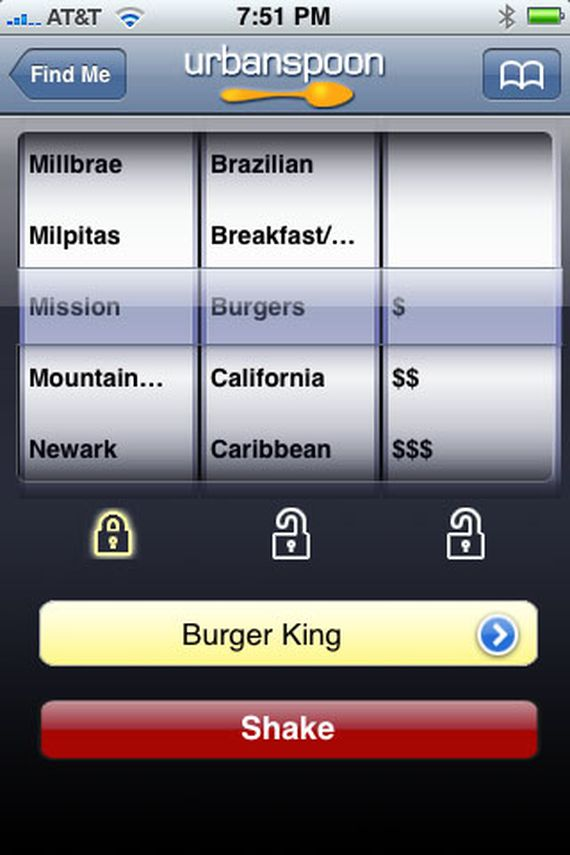

# my_recipe

The app will recreate the old urbanspoon app to help users pick a restaurant.

### Part 1

At the top of the screen there should be a text field to allow users to entire their location or use Location Services to get that information automatically.

### Part 2

Underneath, there should be two slot machine like spinners filled with data from the Zomato api. The two columns should be

* Cuisine
* Price

Users should be able to loop through these three columns and lock any or all of them.

Below the slot machine there will be a spin button that will rotate any of the unlocked columns.  After the columns are done spinning, the app will query Zomato to get a list of Restaurants.

### Part 3

This restaurant list is then pushed to a new screen where users can scroll through the list an selected their favourite restaurants.
